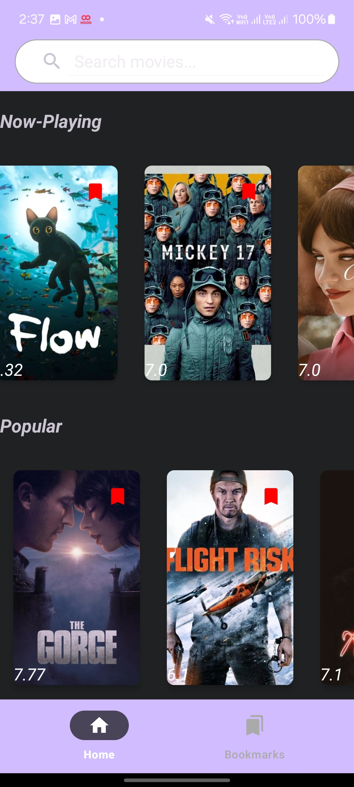
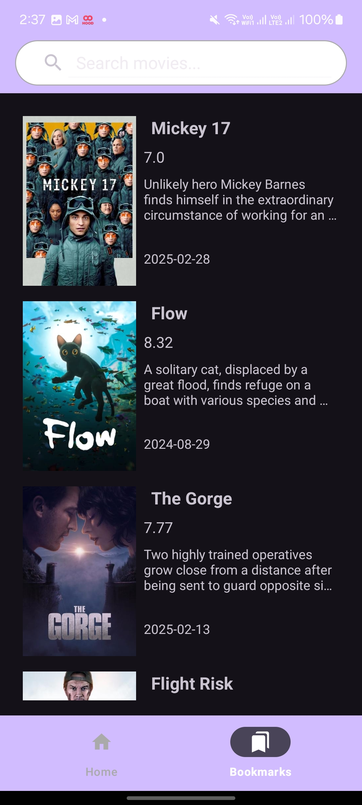
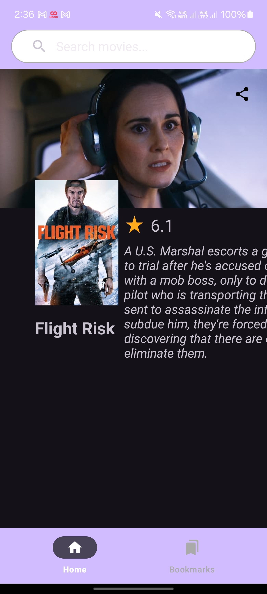
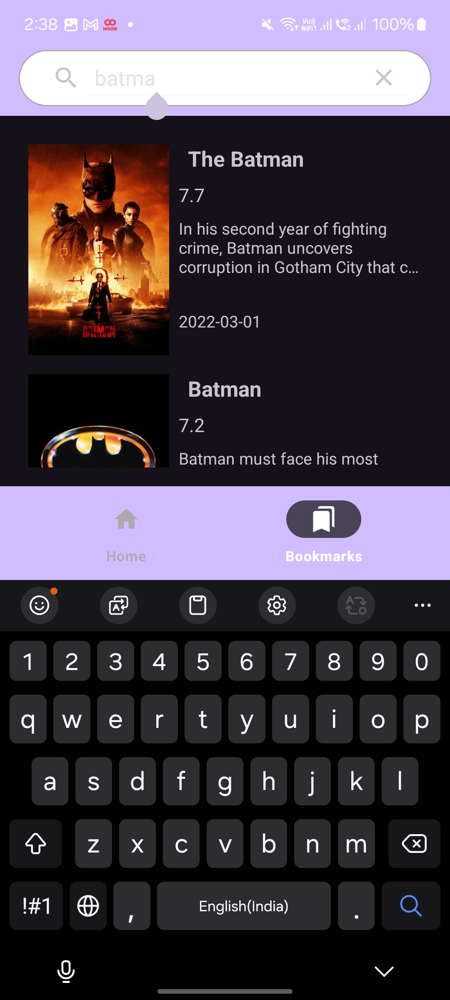
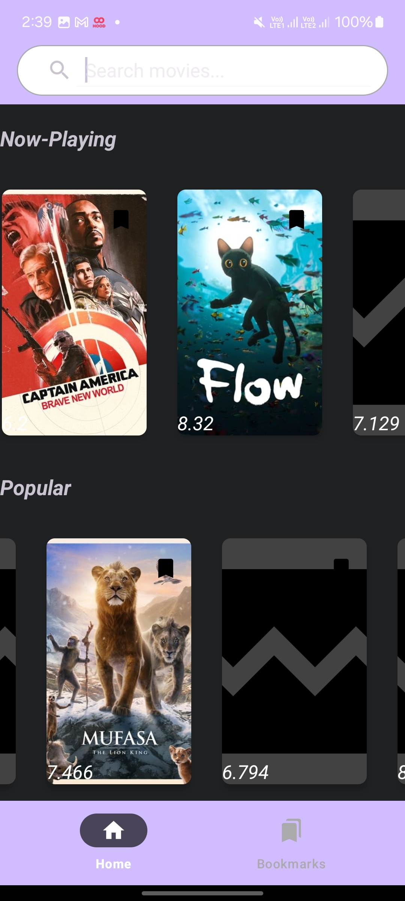

# Movie App
### Using TMDB application

&nbsp;

#### Functional Requirements
1. get movie list form internet
2. cache the movies fetched from the internet for offline mode
3. bookmark movies
4. search movies - use debouncing behavior
5. send dummy link to share movies (implicit intents)

#### tech used
1. kotliin
2. retrofit
3. okhttp3
4. Room
5. Dagger-Hilt

#### APK link
- [apk](https://drive.google.com/file/d/17LMeXWwE3DVseSME0T_c8vVW3G9TzixI/view?usp=drive_link)
- [apk](https://drive.google.com/file/d/1otOgL6KzSybnKVKWYxYpXU_K_lS5JotF/view?usp=drive_link)

&nbsp;

### screenshots

